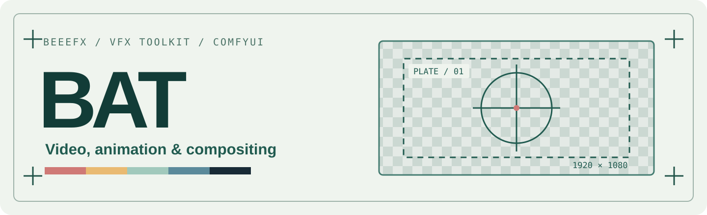
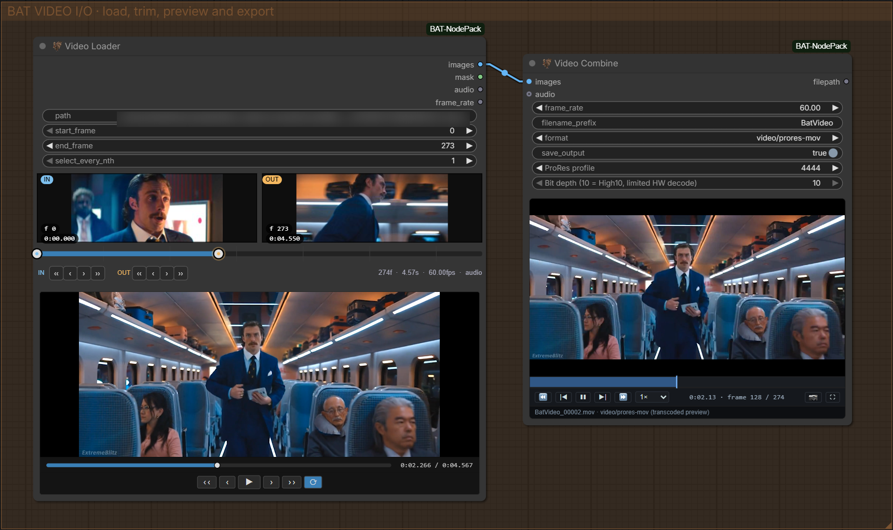
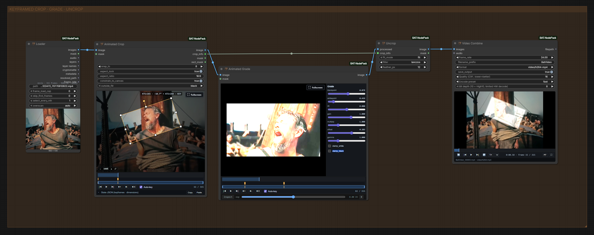
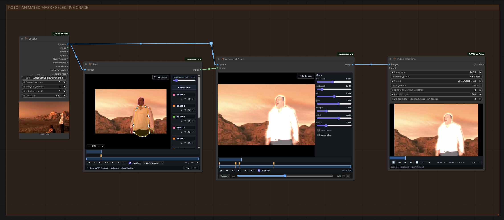

<p align="center">
  
</p>

# 🦇 ComfyUI-BAT-NodePack

[](#all-nodes)
[](https://github.com/BeeeFX/ComfyUI-BAT-NodePack/commits/main/)
[](https://github.com/BeeeFX/ComfyUI-BAT-NodePack/stargazers)
[](LICENSE)
[](https://github.com/BeeeFX/ComfyUI-BAT-NodePack/archive/refs/heads/main.zip)

BAT is my ComfyUI node pack for video, animation, masking, and compositing. Many nodes have previews and editors directly on the graph.

**On-node editors · BAT Profiler**

[Highlights](#highlights) · [All nodes](#all-nodes) · [Install](#install) · [Example workflows](#example-workflows) · [Help](#help)

## Highlights

### Load and export

**Loader** reads stills, sequences, folders, movies, and layered EXRs. **Video Loader** offers visual trimming. **Video Combine** exports video, GIF, WebP, or image sequences.

For EXRs, **EXR Layer** selects passes and **Cryptomatte Matte** builds masks from clicked points. Audio and alpha are available where the source supports them.



*Video Loader → Video Combine.*

### Keyframed adjustments and masks

**Animated Crop**, **Animated Grade**, and **Roto** put keyframes on the node. **Uncrop** places a processed crop back into its source frame.



*Animated Crop → Animated Grade → Uncrop.*



*Roto mask → Animated Grade.*

### Compositing nodes

**Grade**, **Advanced Blend**, **Layered Images**, and **Rescale** cover common compositing tasks. The HDR nodes handle exposure-bracket reconstruction and tonal blending.

### SeC object segmentation

**SeC Segmenter** tracks an object mask through a clip from points or a box. It needs [extra setup](#optional-features).

### Profiler

**BAT Profiler** shows per-node time, RAM, and VRAM in the sidebar. It records run history and can copy a report.

### VACE Batch Tool for WAN VACE 2.1

**VACE Batch Tool** places image and mask keyframes into a WAN VACE 2.1 batch, with fill and premultiplication controls.

## All nodes

Names match the Add Node menu; the 🦇 prefix is omitted here.

[Loading](#loading-media) · [Video](#video-and-frames) · [Animation](#crop-animation-and-masks) · [Compositing](#colour-and-compositing) · [SeC](#sec-masking) · [WAN / VACE](#wan-and-vace) · [Helpers](#workflow-helpers) · [Graph utilities](#graph-utilities)

### Loading media

| Node | Use it to… |
| --- | --- |
| **Loader** | Load stills, sequences, folders, movies, and layered EXRs. |
| **EXR Layer** | Extract a named EXR pass. |
| **Cryptomatte Matte** | Make an EXR object mask from clicked points. |

### Video and frames

| Node | Use it to… |
| --- | --- |
| **Video Loader** | Preview and trim video, with audio and alpha. |
| **Video Combine** | Export video, GIF, WebP, or image sequences. |
| **BAT Frame Picker** | Choose a frame from a contact sheet. |
| **Framehold** | Hold one frame across a batch. |
| **Video Grid Split** | Split video into overlapping grid regions. |
| **Batch Format** | Match frame counts for supported video models. |

### Crop, animation, and masks

| Node | Use it to… |
| --- | --- |
| **Crop** | Draw a crop for later Uncrop. |
| **Animated Crop** | Keyframe a moving crop. |
| **Uncrop** | Return a processed crop to its source. |
| **Animated Grade** | Keyframe colour adjustments. |
| **Roto** | Draw animated Bézier masks. |
| **Grow Mask** | Expand mask edges. |
| **Erode Mask** | Shrink mask edges. |

### Colour and compositing

| Node | Use it to… |
| --- | --- |
| **Grade** | Adjust blackpoint, lift, gain, and gamma. |
| **Advanced Blend** | Blend images; mix tone and detail separately. |
| **Layered Images** | Composite up to eight masked layers. |
| **Rescale** | Resize while comparing at a fixed viewing size. |
| **Exposure Bracket** | Prepare exposures for LTX HDR reconstruction. |
| **Exposure Merge** | Merge reconstructed passes into linear HDR. |
| **HDR Tonal Composite** | Blend reconstructed shadows and highlights into a shot. |

The HDR nodes work with a separate LTX reconstruction workflow. Export their linear output in a suitable format such as EXR.

### SeC masking

| Node | Use it to… |
| --- | --- |
| **SeC Segmenter** | Track an object mask through video. |
| **SeC Advanced Params** | Set model, device, and tracking options. |

### WAN and VACE

| Node | Use it to… |
| --- | --- |
| **VACE Batch Tool** | Arrange WAN VACE 2.1 image and mask keyframes. |
| **WAN Context Calculator** | Set context, stride, and overlap. |
| **WAN Batch Format** | Prepare and pad a WAN video batch. |
| **Batch Crop** | Remove padding after generation. |
| **Wan Reference Aligner** | Align references with WAN context windows. |

### Workflow helpers

| Node | Use it to… |
| --- | --- |
| **Points Editor** | Place labelled points on an image. |
| **Filename Prefix** | Build output names from workflow context. |
| **Bypass Switch** | Toggle bypass for node groups and backdrops. |

### Graph utilities

| Node | Use it to… |
| --- | --- |
| **Show Any** | Display a value and pass it through. |
| **Show Tensor Shape** | Show a tensor's shape, range, and memory use. |
| **Convert Any** | Convert to text, number, or boolean. |
| **Any to String** | Render a value as text or JSON. |
| **Number to String** | Format numbers with padding and precision. |
| **Compare** | Compare values for a boolean output. |
| **Index Switch** | Select one of ten inputs; others don't run. |
| **List Length** | Count items or frames. |
| **List Index** | Select an item or frame. |
| **List Batch** | Join lists or image batches. |

**Also included, without adding a node:**

- **BAT Profiler:** per-node timing and memory in the sidebar.
- **Canvas zoom:** a wider zoom range under **Settings → 🦇 BAT → Canvas**.
- **Run selected outputs:** **Alt+Enter** queues selected output branches.
- **Larger editors:** maximise an editor; **Esc** exits.

## Install

Clone into your active ComfyUI installation's `custom_nodes` folder, then restart:

```bash
cd ComfyUI/custom_nodes
git clone https://github.com/BeeeFX/ComfyUI-BAT-NodePack.git
```

For Desktop, use its active `custom_nodes` folder. Downloading the repository ZIP also works; keep `__init__.py` at the folder root. Search the Add Node menu for **BAT** or 🦇.

### Optional features

Install these with the Python environment that runs ComfyUI:

- **EXR:** `python -m pip install OpenImageIO`. Other Loader formats work without it.
- **SeC:** `python -m pip install -r requirements.txt`. Restart after installation. The default model is about **7.35 GB** and downloads on first use. See [model setup](bat_sec/NOTICE.md#models).

To prevent the SeC model download, connect **SeC Advanced Params** and turn off `auto_download` before running.

## Example workflows

| Goal | Nodes |
| --- | --- |
| **Trim and export** | Video Loader → Video Combine; connect frame rate and audio. |
| **Moving crop** | Animated Crop → processing → Uncrop; also connect `crop_info`. |
| **EXR pass** | Loader → EXR Layer → processing. |
| **Object mask** | Loader → Points Editor + Cryptomatte Matte. |
| **Tracked mask** | Video Loader → SeC Segmenter. |

## Help

<details>
<summary><strong>Nodes missing after install</strong></summary>

Check the active `custom_nodes` folder, restart ComfyUI, and look for a BAT import error in the startup log.

</details>

<details>
<summary><strong>Older BAT or Volt workflows</strong></summary>

**Batch Format** replaces **Video Batch Format** and **WAN Batch Frame Format**. **Batch Crop** was **WAN Batch Crop**; **BAT Frame Picker** replaces **VRI Frame Picker**. Legacy `Volt_*` nodes need the separate ETC migration tool or manual replacement.

</details>

For bugs or suggestions, [open an issue](https://github.com/BeeeFX/ComfyUI-BAT-NodePack/issues). Include the node name and a small workflow or screenshot.

More detail: [technical notes](docs/technical-notes.md).

---

Made by [BeeeFX](https://github.com/BeeeFX).

BAT code is [MIT licensed](LICENSE). The bundled SeC stack has separate [third-party attribution and licensing](bat_sec/NOTICE.md); model weights are downloaded separately.
